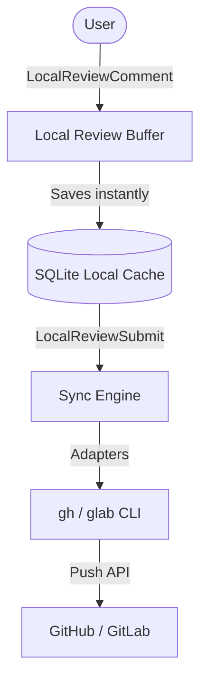

# lreview.nvim 💬

A unified, offline-first, non-invasive Merge/Pull Request code review plugin for Neovim. Review changes locally across GitHub and GitLab using a local SQLite cache.

> ## ⚠️ Warning — Experimental Plugin
>
> **This plugin is still experimental and under active development.**
>
> - Do **not** use this as your primary review tool yet.
> - The API, commands, configuration, and storage format may change or break
>   without notice between versions.
> - There are a bunch of **performance issues** and **likely bugs** along the
>   way that may trigger **unexpected conditions**.
> - Bugs and data-loss edge cases are possible. Use it **at your own risk**.
>
> If you do try it, prefer testing against a **throwaway repository** or a
> **non-critical branch** before relying on it for real reviews.



## Features

- **Offline-First Workflow:** Save draft comments locally instantly; publish them all in a single batch once you finish the review.
- **Asynchronous Engine:** Background pulling and pushing prevent Neovim from freezing during network requests.
- **Unified Adapter Structure:** Handles both GitLab Merge Requests and GitHub Pull Requests with a single unified set of commands and UI.
- **Auto-Garbage Collection:** Keeps the SQLite cache clean by purging old closed/merged reviews after 30 days while safeguarding your local drafts.
- **Dynamic Context Resolution:** Handles forks, nested subgroups (GitLab), and multiple concurrent repositories seamlessly in a single database.

---

## Requirements

- Neovim `0.10+`
- `sqlite3` installed on your system
- [sqlite.lua](https://github.com/kkharji/sqlite.lua) dependency
- Platform CLIs configured and authenticated:
  - `gh` CLI (for GitHub)
  - `glab` CLI (for GitLab)

---

## Installation

Using [lazy.nvim](https://github.com/folke/lazy.nvim):

```lua
{
  "zerosign/lreview.nvim",
  dependencies = {
    "kkharji/sqlite.lua",
  },
  rocks = { "lsqlite3" },
  opts = {
    defaults = {
      db_path = vim.fn.stdpath("data") .. "/lreview/lreview.db",
      ui = {
        decor = "both", -- "both" | "sign" | "virtual_text" | "none"
        layout = "float", -- "float" | "split" | "vsplit" | "buffer"
      },
    },
    ["github\\.com"] = {
      adapter = "github",
      provider = "gh",
      host = "github.com",
    },
    ["gitlab\\.com|gitlab\\..*"] = {
      adapter = "gitlab",
      provider = "glab",
      host = "gitlab.com",
    },
  },
  config = function(_, opts)
    require("lreview").setup(opts)
  end,
  keys = {
    { "<leader>oq",  "<cmd>LocalReviewQuery<cr>",   desc = "List PRs/MRs" },
    { "<leader>ot", "<cmd>LocalReviewToggle<cr>",   desc = "Toggle Review" },
    { "<leader>op", "<cmd>LocalReviewPull<cr>",    desc = "Pull/Sync Review Comments" },
    { "<leader>os", "<cmd>LocalReviewSubmit<cr>",  desc = "Submit PR Review" },
    { "<leader>od", "<cmd>LocalReviewSummary<cr>", desc = "View Review Summary Panel" },
    { "<leader>oA", "<cmd>LocalReviewApprove<cr>", desc = "Approve MR/PR" },
    { "<leader>oC", "<cmd>LocalReviewClose<cr>",   desc = "Close MR/PR" },
    { "<leader>on", "<cmd>LocalReviewCreate<cr>",  desc = "Create MR/PR" },
    { "<leader>oc",  ":LocalReviewComment<cr>",     mode = "x", desc = "Add inline review comment" },
  },
}
```

---

## Usage Workflow

### 1. Enable Review Highlights
Run `:LocalReviewToggle` (or press `<leader>ot`) in a repository. The plugin automatically and lazily resolves the git branch target MR/PR, queries the API, opens the SQLite database, and syncs all remote discussions to SQLite under the hood.

### 2. Browse & Annotate code
* **View Comments:** Hover your cursor over a line marked with comments. The comments panel will open automatically showing the discussion thread.
* **Add a Comment:** Make a visual selection of code lines and run `:LocalReviewComment` (or press `<leader>oc`). Write your comment and save with `:w` or `<leader>s` (automatically closes and caches it as a draft).

### 3. Manage Conversations (Floating Panel)
Press `K` or hover to focus the thread panel. Use these buffer-local keys:
* `r`: Reply to the thread (opens a scratchpad).
* `e`: Edit your local draft comment.
* `d`: Delete your local draft comment.
* `s`: Toggle Resolved/Reopened thread state.
* `q` / `<esc>`: Close the thread view.

### 4. Submit Staged Drafts
Once you finish your review, run `:LocalReviewSubmit` (or `<leader>os`) to batch push all local drafts to the remote platform.

---

## User Commands

| Command | Description |
| :--- | :--- |
| `:LocalReviewQuery [scope]` | Query and list active MRs for this repository (`mine` or `all`). |
| `:LocalReviewDetail [number]` | Print metadata details for a specific MR/PR. |
| `:LocalReviewPull` | Query and sync the latest updates from the remote host. |
| `:LocalReviewSubmit` | Batch submit all local review comments. |
| `:LocalReviewApprove` | Approve the active MR/PR. |
| `:LocalReviewClose` | Close the active MR/PR. |
| `:LocalReviewCreate` | Create a new MR/PR using template and branch pickers. |
| `:LocalReviewToggle` | Toggle buffer review signs and virtual text annotations. |
| `:LocalReviewSummary` | Open the interactive review summary panel. |
| `:LocalReviewNext` | Jump to the next comment thread in the current buffer. |
| `:LocalReviewPrev` | Jump to the previous comment thread in the current buffer. |

---

## Configuration Options

Pass these options inside the `setup()` block to customize behaviors:

```lua
require("lreview").setup({
  defaults = {
    db_path = vim.fn.stdpath("data") .. "/lreview/lreview.db",
    db = {
      busy_timeout_ms = 5000,
      keep_days = 30, -- Garbage collect reviews older than 30 days
    },
    ui = {
      decor = "both", -- Annotation style: "sign" | "virtual_text" | "both" | "none"
      layout = "float", -- Float style: "float" | "split" | "vsplit" | "buffer"
      float = {
        border = "rounded",
        width = 0.5, -- Floating window width (percentage of editor)
        height = 0.6, -- Floating window height (percentage of editor)
      },
      split = {
        position = "botright",
        size = 15,
      }
    },
    open = { method = "checkout" },
  }
})
```

---

## Gutter Line Highlights & Customization

The plugin highlights gutter line numbers and signs to represent review statuses and code changes. These are linked to standard Vim groups by default so they match your theme automatically, but you can override them in your configuration:

* `LReviewSignDraft` (Default: `WarningMsg` link) - Sign column indicator for draft comment threads.
* `LReviewSignSynced` (Default: `Comment` link) - Sign column indicator for active remote threads.
* `LReviewNumDraft` (Default: `DiffChange` link) - Gutter line number background highlight for drafts.
* `LReviewNumSynced` (Default: `DiffAdd` link) - Gutter line number background highlight for active threads.
* `LReviewNumResolved` (Default: `Comment` link) - Gutter line number background highlight for resolved threads.
* `LReviewDiffAdd` (Default: `DiffAdd` link) - Gutter line number background highlight for git diff changes.

---

## Adding Custom Platform Adapters (Backends)

`lreview.nvim` is fully extensible. You can add support for other hosting platforms (e.g. Gitea, Sourcehut, or custom internal systems) by defining a custom adapter module and registering it through the `opts` setup without changing any plugin code:

1. **Create your custom adapter file** (e.g. `lua/my_adapters/gitea.lua`):
   ```lua
   local M = {}
   M.name = "gitea"
   M.provider = "gitea-cli"

   -- Implement the standard adapter contract functions:
   function M.query(cfg, scope, ctx) ... end
   function M.get_mr(cfg, ctx) ... end
   function M.fetch_comments(cfg, ctx, last_sync) ... end
   function M.create_comment(cfg, ctx, path, line, body) ... end
   function M.create_reply(cfg, ctx, reply_to_id, body) ... end
   function M.edit_comment(cfg, ctx, remote_comment_id, body) ... end
   function M.delete_comment(cfg, ctx, remote_comment_id) ... end
   function M.resolve_thread(cfg, ctx, remote_thread_id, resolved) ... end

   return M
   ```

2. **Register it in your configuration:**
   ```lua
   opts = {
     ["gitea\\.mycompany\\.com"] = {
       adapter = "my_adapters.gitea", -- Dynamically required on remote host match
       provider = "gitea-cli",
       host = "gitea.mycompany.com",
     }
   }
   ```

---

## Performance & Caching Details

- **SQLite Engine Compatibility (Flavors):** The storage layer dynamically binds to the system `libsqlite3.so` library using **LuaJIT FFI** (Foreign Function Interface) for native C execution speed and zero-overhead Neovim startup. If LuaJIT FFI is unavailable, it automatically falls back to loading the standard LuaRocks `lsqlite3` module.
- **WAL Mode & Concurrency:** SQLite is initialized with Write-Ahead Logging (`PRAGMA journal_mode=WAL; PRAGMA synchronous=NORMAL;`) to support concurrent read and write operations. This prevents SQLite lockups and lets background pull workers update comments without blocking the main Neovim thread.
- **Safety Gate Keepers:** Automatic garbage collection runs asynchronously on startup. Old closed/merged reviews are deleted to keep the database size minimal. **Local drafts and threads with draft comments are strictly preserved and skipped by the garbage collector.**

---

## Development

Tests, coverage, and benchmarks run through the sandbox Neovim (`scripts/sandbox-nvim.fish`) so they never touch your real `~/.config/nvim`. All recipes are defined in the `justfile`:

```sh
just test              # unit tests (offline, mock-based)
just test-one test_git # run a single test by name
just test-integration  # integration tests (hit live GitHub/GitLab APIs)
just test-all          # unit + integration
just coverage          # unit tests under luacov -> luacov.report.out
just coverage-summary  # compact coverage summary
just bench             # SQL query latency benchmark (1000 iterations)
```

Coverage is scoped to `lua/lreview/` via `.luacov`. The integration tests require authenticated `gh`/`glab` CLIs and the seeded sample repos in `tmp/`.

---

License: MIT
