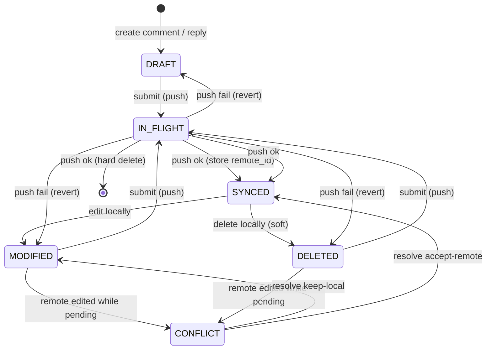
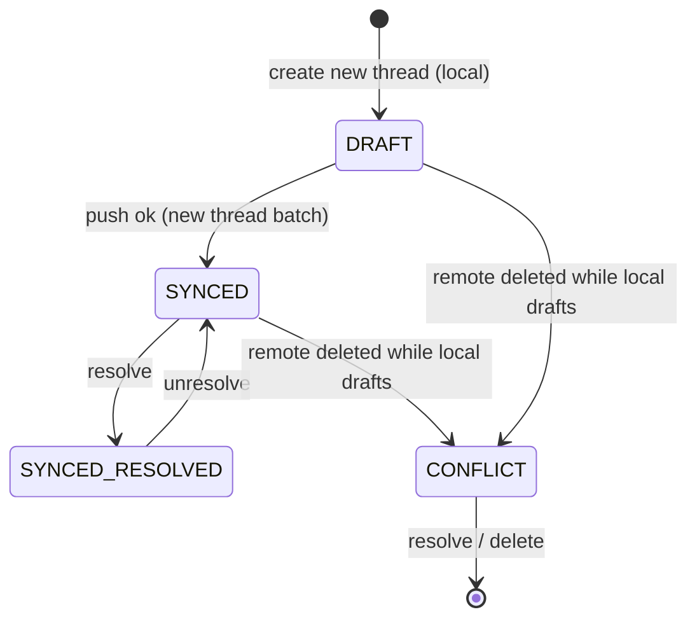

# 07 — Submit Atomicity & `sync_review` Decomposition

**Area:** Core engine robustness (`review.lua`)
**Domain:** 4 — Correctness & Maintainability

---

## 1. Problem

Two correctness/maintainability issues found in the initial architecture review:

### 1.1 Non-Atomic Submit → Partial-Failure Inconsistency

In `submit_review()`:

- New threads are batched, but **replies/edits/deletes are pushed one-by-one in
  a loop**.
- On the first failure it returns `count, err` **mid-way**.
- Already-pushed items were **deleted locally**, but failed ones remain.
- The final `M.sync_review()` only runs on **full success** — so after a partial
  failure, the local DB is out of sync with the remote (some pushed, some not),
  and there is **no resume/retry path** that knows which were already sent.

This is the single most likely source of real-world data inconsistency.

### 1.2 `sync_review()` Is a 40-Complexity Monolith

`sync_review()` (complexity 40) handles ~4 distinct concerns in one 200-line
function with nested loops and manual `vim.mpack.decode` re-decoding:

1. New thread insert + draft preservation + synced update.
2. Modified/conflict detection.
3. Remote-side comment deletion reconciliation.
4. Remote-side thread deletion reconciliation.

The `local_c` → `decoded_lc` re-find dance queries the same comment 2–3 times —
a code smell.

---

## 2. Proposed Solution

### 2.1 Make Submit Resumable / Idempotent

> **Cross-cutting:** whether new threads can be submitted in one batch (vs.
> one-by-one) is gated by the `batch_submit` capability in
> [08-capability-system.md](08-capability-system.md).
>
> **This capability changes the atomicity requirements, not just the code
> path.** With `batch_submit = true`, all new threads go in one network call →
> the batch succeeds or fails together (simpler atomicity). With
> `batch_submit = false`, each thread is a separate call → partial failure is
> *more likely*, so the `IN_FLIGHT` + idempotent-retry machinery below is
> *more critical*. The design must be correct for the one-by-one path even
> though the batch path is the common case.

**Goal:** after a partial failure, a retry must not double-push, and the local
DB must reflect reality.

**Approach — per-item `IN_FLIGHT` state + idempotent retry:**

> **Naming note:** the transient state is `IN_FLIGHT` (not `PUSHING` or
> `PENDING`). `PENDING` would collide with the existing `PENDING_PUSH_MASK`
> (which already means "needs to be pushed" = DRAFT/MODIFIED/DELETED) and
> describes the wrong phase — the item isn't waiting, it's actively being
> transmitted. `IN_FLIGHT` is unambiguous about the transient in-progress
> nature.

1. Add an `IN_FLIGHT` state (or an `in_flight` flag) to comments that are
   currently being submitted.
2. Before pushing each item, mark it `IN_FLIGHT` (persisted).
3. On success, transition to `SYNCED` (or delete for new threads) and store the
   `remote_id`.
4. On failure, revert `IN_FLIGHT` → original state, and **record which items
   succeeded** so a retry skips them.
5. Always run `sync_review()` at the end — even on partial failure — to
   reconcile local state with the remote.

**Idempotency:** because each item stores its `remote_id` once pushed, a retry
can detect "already pushed" and skip. New threads get their `remote_id` back
from the batch response.

```lua
-- review.lua (submit_review, revised)
for _, r in ipairs(replies) do
  comments.mark_in_flight(r.c_id)               -- persist IN_FLIGHT
  local comment_id, err = adapter.submit_reply(...)
  if not comment_id then
    comments.revert_in_flight(r.c_id)           -- back to DRAFT/MODIFIED
    M.sync_review()                             -- reconcile, even on failure
    return count, err
  end
  comments.mark_synced(r.c_id, comment_id)      -- store remote_id
  count = count + 1
end
M.sync_review()                                 -- always reconcile at end
```

### 2.2 Decompose `sync_review()` into Focused Functions

Split into small, testable pieces:

```lua
-- review.lua (sync_review, decomposed)
function M.sync_review()
  local remote_threads, err = adapter.fetch_threads(...)
  if not remote_threads then return 0, err end

  local remote_t_ids, remote_c_ids = M._sync_threads(remote_threads, detail)
  M._reconcile_remote_comment_deletions(detail, remote_c_ids)
  M._reconcile_remote_thread_deletions(detail, remote_t_ids)
  return #remote_threads, nil
end

function M._sync_threads(remote_threads, detail) ... end   -- insert/update threads + comments
function M._reconcile_remote_comment_deletions(detail, remote_c_ids) ... end
function M._reconcile_remote_thread_deletions(detail, remote_t_ids) ... end
```

**Also:** introduce a single `decode_row()`/`encode_row()` helper (or a typed
accessor layer) to replace the manual `vim.mpack.decode` re-decoding and the
`local_c` → `decoded_lc` re-find dance.

### 2.3 The Change-Diff / Intent Model — the Foundation for Idempotency

> **Key insight (from review):** idempotency is the real win here, but it
> requires **diffing the pending changes first** — computing exactly *what* is
> added, removed, and updated — before submitting. The `IN_FLIGHT` state alone is
> not enough; we need a **change-set** that both drives the submit and lets a
> retry detect what was already pushed.

The plugin already has the raw material: `get_pending_comments()` queries
comments whose state matches `PENDING_PUSH_MASK` (DRAFT + MODIFIED + DELETED).
But this is an implicit, ad-hoc diff. We should make it an **explicit, typed
change-set**:

```lua
-- review.lua — compute the change-set (the "diff" of local intent)
-- Returns a typed structure, NOT a flat list of comments.
function M.compute_change_set(mo_id)
  local pending = comments.get_pending_comments(mo_id)
  local cs = {
    additions = {},   -- new threads (DRAFT thread + DRAFT comment)
    replies   = {},   -- replies to existing synced threads
    updates   = {},   -- MODIFIED comments (edit)
    deletions = {},   -- DELETED comments (soft-delete to push)
  }
  for _, d in ipairs(pending) do
    if d.state == comments.STATE.DELETED then
      cs.deletions[#cs.deletions + 1] = d
    elseif d.state == comments.STATE.MODIFIED then
      cs.updates[#cs.updates + 1] = d
    elseif comments.thread_is_draft(d.thread_state) then
      cs.additions[#cs.additions + 1] = d
    else
      cs.replies[#cs.replies + 1] = d
    end
  end
  return cs
end
```

**Why this is the foundation for idempotency:**

- **It defines "what needs to be pushed"** — the change-set is the single source
  of truth for the submit loop. No scattered `if state == ...` checks.
- **It enables "what was already pushed"** — after a partial failure, the
  change-set is recomputed; items that transitioned to `SYNCED` (or were
  deleted) drop out of the set, so a retry naturally skips them. **This is what
  makes retries idempotent** — not a separate "already pushed" list, but the
  state transition itself.
- **It's the same lens as `sync_review`** — the reconcile logic (doc 07 §2.2)
  and the submit logic both operate on the same state machine, so they agree on
  what's pending vs. synced.

**The state machine as the diff:**

| Local state | Meaning | In change-set? | After successful push |
|:--|:--|:--|:--|
| `DRAFT` (new thread) | addition | ✅ additions | thread → `SYNCED`, comment → `SYNCED` + `remote_id` |
| `DRAFT` (reply) | reply | ✅ replies | comment → `SYNCED` + `remote_id` |
| `MODIFIED` | update | ✅ updates | comment → `SYNCED` (body = pushed body) |
| `DELETED` | removal | ✅ deletions | comment hard-deleted |
| `SYNCED` | clean | ❌ not in set | — |
| `CONFLICT` | blocked | ❌ (blocks submit) | — |

**The change-set is the contract between submit and sync.** Both consume the
same state machine, so a retry after partial failure recomputes the set, sees
only the still-pending items, and pushes exactly those. This is the cleanest
form of idempotency — it falls out of the state transitions, not a parallel
bookkeeping structure.

### 2.4 User Feedback — Success / Failure / Partial-Failure

> **Gap (from review):** the current `submit_review` returns `count, err` but
> gives the user **no clear feedback** on what happened. The revised flow must
> tell the user, unambiguously, whether the submit fully succeeded, partially
> failed, or failed entirely — and what to do next.

**Feedback contract** (all via `vim.notify`, replayed on the main thread from
the `uv.new_work` callback — see §2.5):

| Outcome | User sees | Next step |
|:--|:--|:--|
| **Full success** | `"Pushed N change(s) to <provider>"` (INFO) | none |
| **Partial failure** | `"Pushed N of M change(s); K failed. Retry with :LocalReviewSubmit"` (WARN) + per-item error detail | retry; already-pushed items are skipped (idempotent) |
| **Full failure** | `"Failed to push: <err>"` (ERROR) | fix and retry |
| **Blocked by conflicts** | `"K conflict(s) must be resolved before pushing"` (WARN) | resolve conflicts first |
| **Cancelled** | `"push cancelled"` (INFO) | none |

**Per-item detail:** on partial failure, the notification should list *which*
items failed and why (e.g. `"reply to <path>:<line> failed: <err>"`), so the
user knows what to fix. This is collected into the change-set result and
replayed on the main thread.

**The `IN_FLIGHT` state also gives feedback:** while a submit is in flight, the
statusline (doc 04) can show `"pushing 3/5..."` — a live progress indicator
driven by the change-set count.

### 2.5 Integration with `uv.new_work` (from Doc 09)

> **Cross-cutting:** the submit path is **network I/O** (the slowest category in
> doc 09 §8). It must run on the `uv.new_work` thread, not block the main thread.
>
> **Capability interplay (doc 08):** the submit path's network calls
> (`submit_inline_review`, `submit_reply`, `update_comment`, `delete_comment`,
> `approve_mr`) all run on the thread. The `batch_submit` capability decides
> whether the new-thread call is one batched call or N one-by-one calls — both
> run on the thread. The verdict path (`review_verdict` → `approve_mr`) is also
> thread work. See doc 08 §3.1 for the full capability→action→event matrix.

The submit flow runs on the thread exactly like `sync_review` (doc 09 §7):

1. **On the main thread:** resolve the adapter/ctx (uses `vim.fn`, not
   thread-safe), compute the change-set (pure DB read), and show the confirm
   popup (doc 03).
2. **On the thread:** run the push loop (network calls via `base.run`), updating
   the DB via the thread's **own** connection. Collect `{msg, level}`
   notifications and the per-item results.
3. **Back on the main thread (via `vim.schedule`):** replay notifications,
   refresh panels, and show the outcome (success/partial/failure per §2.4).

```lua
-- review.lua — submit on the thread
local submit_work = vim.uv.new_work(function(cwd, detail, resolved, change_set, db_path, lazy_sqlite)
  -- open own connection, run the push loop, update DB, collect notifications
  return { ok = ..., pushed = n, failed = m, notifications = {...} }
end, function(result)
  vim.schedule(function()
    for _, n in ipairs(result.notifications) do vim.notify(n[1], n[2]) end
    -- refresh panels
  end)
end)
```

**Thread-awareness of the `IN_FLIGHT` state (doc 09 §8.6):** the `IN_FLIGHT` state
lives in the DB, which the thread writes via its own connection. Because the
thread and main process use **separate connections** (WAL), the state transition
is safe. The main thread reads `IN_FLIGHT` for the statusline progress indicator;
the thread writes it. No shared-memory race (separate connections, WAL).

**Idempotency across the thread boundary:** the change-set is computed on the
main thread *before* queueing, but the **state transitions happen on the
thread**. On a retry, the change-set is recomputed on the main thread from the
(now-updated) DB — so items the thread already pushed to `SYNCED` drop out. The
idempotency comes from the state machine, not from passing the stale change-set
around.

### 2.6 State Machine (Graph)

> **Rendering:** these are **Mermaid `stateDiagram-v2`** diagrams, which render
> natively in leaf/GitHub markdown viewers (no plugin needed). Nodes = states,
> edges = the action that triggers the transition.

#### 2.6.1 Comment state machine

This is the core of the atomicity design. The `IN_FLIGHT` state is the transient
"being pushed right now" node; everything else is the existing state machine.



**Legend of the edges (actions):**

| Edge | Action | Function |
|:--|:--|:--|
| `[*] → DRAFT` | Create comment / reply | `add_comment` |
| `SYNCED → MODIFIED` | Edit a synced comment | `update_comment_body_and_state(..., MODIFIED)` |
| `SYNCED → DELETED` | Delete a synced comment (soft) | `soft_delete_comment` |
| `→ IN_FLIGHT` | Submit (push in progress) | `mark_in_flight` |
| `IN_FLIGHT → SYNCED` | Push succeeded | `mark_comment_synced` |
| `IN_FLIGHT → [*]` | Delete pushed (hard) | `delete_comment` |
| `IN_FLIGHT → <orig>` | Push failed (revert) | `revert_in_flight` |
| `MODIFIED/DELETED → CONFLICT` | Remote changed while pending | `mark_comment_conflict` |
| `CONFLICT → MODIFIED` | Resolve keep-local | `resolve_conflict_keep_local` |
| `CONFLICT → SYNCED` | Resolve accept-remote | `resolve_conflict_accept_remote` |

**Invariants:**
- `IN_FLIGHT` is **transient** — it must never persist across a crash (see open
  question 2). On startup, any `IN_FLIGHT` item is reverted to its prior state.
- `CONFLICT` is a **sink** for user action — it blocks submit until resolved.
- `SYNCED` is the **stable** state — matches remote, not in the change-set.

#### 2.6.2 Thread state machine

Threads are simpler — the `RESOLVED` bit is combinable with `SYNCED`.



**Legend:**

| Edge | Action | Function |
|:--|:--|:--|
| `[*] → DRAFT` | Create new thread | `create_thread` |
| `DRAFT → SYNCED` | New thread pushed | `mark_synced` |
| `SYNCED ↔ SYNCED_RESOLVED` | Resolve / unresolve | `resolve_thread` |
| `→ CONFLICT` | Remote deleted while local drafts | `mark_thread_conflict` |

> **Note:** `SYNCED_RESOLVED` is not a separate state value — it's the `SYNCED`
> bit OR'd with the `RESOLVED` bit (state = 2 | 4 = 6). The diagram shows it as
> a distinct node for clarity.

### 2.7 SQLite Transaction Strategy

**Today:** every `storage.execute`/`storage.query` is a single auto-commit
statement. There is no `BEGIN`/`COMMIT`/`ROLLBACK` wrapper anywhere. Each
`mark_comment_synced` is actually *two* statements (a `SELECT` + an
`INSERT OR REPLACE` via `add_comment`), each committed independently.

**Why the submit path needs transactions:** the submit does a multi-item,
multi-step write — mark all items `IN_FLIGHT` (N writes) → push → mark all
items `SYNCED` (N writes). Without a transaction, a crash mid-way leaves the
DB half-committed (some `IN_FLIGHT`, some `SYNCED`, some still `DRAFT`) — the
exact inconsistency this doc exists to prevent.

#### 2.7.1 The critical rule: never hold a write txn across the network

The network push **must never be inside a SQLite write transaction**. Holding
a write lock across a network round-trip (seconds) would:
- block the UI thread's per-buffer reads for the whole duration,
- block the GC thread's writes,
- defeat the entire point of the async model (doc 09).

So the structure is **two short transactions bracketing the network call**:

```
BEGIN IMMEDIATE;              -- Txn 1: fast, local, all-or-nothing
  mark all items IN_FLIGHT
COMMIT;
... network push (NO txn) ... -- slow, on uv.new_work thread
BEGIN IMMEDIATE;              -- Txn 2: fast, local, all-or-nothing
  mark all items SYNCED (or revert to prior state on failure)
COMMIT;
```

#### 2.7.2 Perf: this is cheap, not a lag source

The transactions are **microsecond-scale**, so they do not lag the UI:

- **WAL mode is already on** (`storage/init.lua:87`) — readers don't block
  writers and writers don't block readers.
- **`synchronous=NORMAL`** (`storage/init.lua:88`) — no fsync per commit, only
  at checkpoint.
- Each txn is a handful of tiny `UPDATE`/`INSERT` statements on indexed rows.
- The **only slow part is the network call, and it's outside any txn** — and it
  runs on the `uv.new_work` thread (doc 09), so the UI never blocks on it.

The UI-lag concern is really about *network + DB writes on the main thread*.
Doc 09 already moves the network to a thread. The DB writes are so fast
(sub-ms for a few rows in WAL) they don't need to move off the main thread —
but if we want to be extra safe, the whole submit (txn 1 + network + txn 2)
runs on the thread with its **own connection**, which is doc 09 §7's sketch.

#### 2.7.3 Helper

Add a small transaction wrapper to `storage/init.lua`:

```lua
--- Run a function inside a transaction. Returns (ok, err).
---@param fn fun(): boolean|nil, string|nil
---@return boolean, string|nil
function M.transaction(fn)
  ensure_db()
  M.db:execute("BEGIN IMMEDIATE")
  local ok, err = pcall(fn)
  if not ok then
    M.db:execute("ROLLBACK")
    return false, err
  end
  M.db:execute("COMMIT")
  return true, nil
end
```

`BEGIN IMMEDIATE` (not `BEGIN`) takes the write lock up front, so the
all-or-nothing guarantee holds even if a concurrent writer sneaks in between
the `BEGIN` and the first write.

#### 2.7.4 Where transactions wrap in the submit path

| Phase | Wrapped? | Why |
|:--|:--|:--|
| Mark `IN_FLIGHT` (before push) | **Yes** (txn 1) | all-or-nothing: no partial in-flight |
| Network push | **No** | must not hold write lock across network |
| Mark `SYNCED` / revert (after push) | **Yes** (txn 2) | all-or-nothing: no partial sync |
| `sync_review()` reconcile | **Yes** (own txn) | batch of inserts/updates from remote |

### 2.8 Scaling for Large MRs

**The transaction design is O(1) overhead regardless of MR size** — txn 1 and
txn 2 are each a single `BEGIN`/`COMMIT` pair, identical for 1 comment or 500.
WAL + `synchronous=NORMAL` keep commits cheap. The network (the real O(N)
cost) is outside any txn and on the thread. **Transactions are not the scaling
concern.**

The real scaling pressure is in the **existing `sync_review` reconcile loop**
(`review.lua:426-560`), which is **O(N) queries for N comments**:

| Line | Query | Runs per |
|:--|:--|:--|
| `review.lua:469` | `SELECT * FROM comments WHERE t_id = ?` | every remote comment |
| `review.lua:480` | `comments.comments_for_thread(t_id)` | every remote comment |
| `review.lua:491` | `SELECT * FROM comments WHERE c_id = ?` | every DELETED comment |

So a single comment can trigger **3 separate queries** (parse + bind + step +
finalize each). A 300-comment MR → ~900 queries, on the main thread today.
**This is the real lag source on big MRs.**

#### 2.8.1 Fix: batch the reconcile into one query + in-memory index

Load all local comments for the MR **once**, index them in a Lua table, then do
the reconciliation in memory — zero DB queries in the inner loop:

```lua
-- ONE query for the whole MR, indexed by t_id → c_id
local local_by_thread = {}
for _, lc in ipairs(storage.query([[
  SELECT c.*, t.path, t.line_start, t.line_end, t.state as thread_state
  FROM comments c JOIN threads t ON c.t_id = t.t_id
  WHERE t.mo_id = ?
]], detail.mo_id)) do
  local_by_thread[lc.t_id] = local_by_thread[lc.t_id] or {}
  local_by_thread[lc.t_id][lc.c_id] = lc
end

-- inner loop: pure in-memory lookup, no DB
local lc = local_by_thread[t.t_id] and local_by_thread[t.t_id][c.c_id]
```

This turns **~3N queries → 1 query + O(N) in-memory lookups**. The same
batching applies to the remote-deletion pass (`review.lua:568`) and the
thread-deletion pass (`review.lua:600`), which already use single queries.

#### 2.8.2 The UI hot path already scales

`comments_for_buffer` (`comments.lua:342`) is a **single indexed query** using
`idx_threads_buffer(mo_id, path, line_start, line_end)` — it returns all
comments for a file+line range in one shot. That's O(comments in buffer), not
O(comments in MR). Rendering a buffer does not degrade with MR size.

#### 2.8.3 Submit path already scales

`submit_review` does one `get_pending_comments(mo_id)` query (single indexed
query), then groups into `new_threads_batch`/`replies`/`edits`/`deletes`. The
per-item work is the network push (on the thread) + txn-wrapped state
transitions. No N+1 there.

#### 2.8.4 Composition with the async model

The batched `sync_review` runs on the `uv.new_work` thread (doc 09) with its
**own connection**, so even the O(N) reconcile work never blocks the UI. The
main thread only ever runs the O(1) per-buffer query.

#### 2.8.5 Measured benchmark (lsqlite3, in-memory, WAL)

> Full methodology, raw data, and the bitmap analysis live in
> [10-benchmark.md](10-benchmark.md). This is the summary.

Benchmarked the actual query patterns with `lsqlite3` (SQLite 3.53.4) across
the three scaling dimensions — **files changed**, **threads per file**, and
**pending comment changes** (creation/replies/edits/deletions). Times are
single-run wall-clock on the main thread (the worst case, before the async
move):

| Scenario | files | threads | total cmts | pending | N+1 reconcile | batched reconcile | txn (500) | per-buffer | change-set |
|:--|--:|--:|--:|--:|--:|--:|--:|--:|--:|
| small | 5 | 10 | 40 | 10 | 0.7 ms | 0.11 ms | 0.02 ms | 0.04 ms | 0.08 ms |
| medium | 20 | 80 | 450 | 50 | 8.5 ms | 0.96 ms | 0.07 ms | 0.06 ms | 0.18 ms |
| large | 50 | 400 | 3,400 | 200 | **72 ms** | 6.5 ms | 0.30 ms | 0.13 ms | 0.77 ms |
| huge | 100 | 1,200 | 14,900 | 500 | **361 ms** | 31 ms | 0.78 ms | 0.32 ms | 2.9 ms |

**What the data confirms:**

- **The N+1 reconcile is the real lag source.** It grows linearly with comment
  count: 0.7 → 8.5 → 72 → 361 ms. At 3,400 comments it's a visible UI hitch;
  at 14,900 it's a half-second freeze — **on the main thread today**.
- **Batching is an ~11x win.** 72 → 6.5 ms (large), 361 → 31 ms (huge). Even at
  15k comments the batched reconcile is 31 ms — and it runs on the thread
  (doc 09), so the UI never sees it.
- **Transactions are negligible** — and actually *faster* than auto-commit
  (0.78 → 0.63 ms for 500 writes) because a single commit avoids per-statement
  fsyncs. Confirms §2.7: wrap the local writes, never the network.
- **The per-buffer query scales flat** (0.04 → 0.32 ms) — indexed by
  `(mo_id, path, line_start, line_end)`, it's O(comments in buffer), not
  O(comments in MR). The UI hot path is not a concern even at 15k comments.
- **The change-set query scales fine** (0.08 → 2.9 ms) — one indexed query.

**On the bitmap idea:** the batched reconcile is already 31 ms at 15k comments
via a single SQL scan + in-memory hash index. A bitmap would add a data
structure to represent a set SQLite already produces efficiently — and comment
IDs are UUIDs, not dense integers, so a bitmap would need a hash→index mapping
(a *second* structure). The measured cost is the SQL scan, not the in-memory
work, so a bitmap buys nothing. **Rejected — keep the batched query + hash
index.**

---

## 3. Flow / Sequence

### Submit (revised — change-set + thread + feedback)

```
submit_review()                                    [main thread]
  ├─ compute_change_set(mo_id)                     → { additions, replies, updates, deletions }
  ├─ check conflicts → block if any
  ├─ confirm_popup (Doc 03)
  ├─ queue submit_work:queue(cwd, detail, resolved, change_set)   [uv.new_work thread]
  │    ├─ batch new threads → mark_synced(remote_id)
  │    ├─ loop replies/updates/deletions:
  │    │    mark_in_flight → push → mark_synced(remote_id) | revert_in_flight on fail
  │    └─ sync_review()  ← ALWAYS runs, even on partial failure
  └─ [vim.schedule callback] replay notifications + show outcome
       (success / partial / failure per §2.4)
```

### Sync (decomposed)

```
sync_review()
  ├─ fetch_threads()
  ├─ _sync_threads()          → insert/update threads + comments
  ├─ _reconcile_remote_comment_deletions()
  └─ _reconcile_remote_thread_deletions()
```

---

## 4. Before / After

### Before (submit)

```
loop replies/edits/deletes:
  push → delete locally on success
  on failure: return count, err   ← mid-way, no reconcile
sync_review() only on full success
```

**Problems:** Partial failure leaves DB out of sync. No resume path. No
reconcile on failure.

### After (submit)

```
compute_change_set() → { additions, replies, updates, deletions }
queue submit_work (uv.new_work thread):
  loop: mark_in_flight → push → mark_synced(remote_id)
        on failure: revert_in_flight, sync_review()
  sync_review() always runs at end
vim.schedule callback: replay notifications + show outcome
```

**Improvements:** Resumable/idempotent (change-set drops pushed items). Local DB
reconciled even on failure. Retry skips already-pushed items. Clear user
feedback on success/partial/failure. Runs on the thread (no UI block).

### Before (sync)

```
sync_review() — 40-complexity monolith, nested loops, manual mpack re-decoding
```

### After (sync)

```
sync_review() → _sync_threads + _reconcile_remote_comment_deletions
              + _reconcile_remote_thread_deletions
```

**Improvements:** Testable, readable, single decode helper.

---

## 5. Pros & Cons

### Pros

- **Data integrity** — no more partial-failure inconsistency.
- **Resumable** — retries are safe and idempotent (via the change-set + state
  transitions).
- **Clear feedback** — user always knows success/partial/failure and next step.
- **Non-blocking** — submit runs on the `uv.new_work` thread (doc 09).
- **Maintainable** — `sync_review` becomes testable units; the change-set is a
  typed, testable structure.
- **Foundation** — Doc 03 (verdict) builds on the revised submit flow.

### Cons

- **New state** (`IN_FLIGHT`) — schema/state-machine change in `comments.lua`.
- **Change-set abstraction** — a new typed structure + `compute_change_set()`
  to build and maintain.
- **Refactor risk** — `sync_review` is the highest-risk function; needs good
  test coverage before/after.
- **More code paths** — in-flight/reverting states add branches.
- **Thread plumbing** — the submit path needs the `uv.new_work` wrapper + own
  connection (doc 09 §7), plus notification replay.

---

## 6. Alternatives

### Alt A — Make the whole submit a single atomic batch (all-or-nothing)
- **Pros:** Simplest mental model.
- **Cons:** Not all platforms support batch replies/edits/deletes; a single
  failure would roll back everything (or require compensating calls). Hard to
  guarantee. **Rejected** — not feasible across platforms.

### Alt B — Keep per-item push, but always run `sync_review()` on failure
- **Pros:** Minimal change (just move the reconcile call).
- **Cons:** Doesn't solve the resume problem — a retry could double-push items
  that succeeded but weren't reconciled. **Partial** — good first step.

### Alt C — Recommended: change-set + IN_FLIGHT state + idempotent retry + reconcile
- **Pros:** Correct, resumable, safe retries (idempotency falls out of the state
  transitions). Clear feedback. Runs on the thread.
- **Cons:** More state + a change-set abstraction. **Accepted.**

---

## 7. Open Questions

1. Should `IN_FLIGHT` be a persisted state or an in-memory flag? (Persisted is
   safer for crash recovery, but adds schema complexity.)
2. How to handle a crash *during* a push (IN_FLIGHT left in DB)?
3. Should the batch new-thread response return per-item `remote_id`s, or does
   the adapter need to return them explicitly?
4. Should the change-set be a **pure function** (`compute_change_set(mo_id)`)
   or a **materialized table** (a `pending_changes` table the submit loop reads)?
   (Pure function is simpler; a table enables richer queries but adds sync
   complexity.)
5. For partial-failure feedback, should the per-item errors be **aggregated into
   one notification** or **one notification per failed item**? (Aggregated is
   less noisy; per-item is more actionable.)
